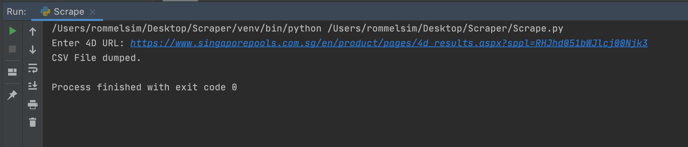
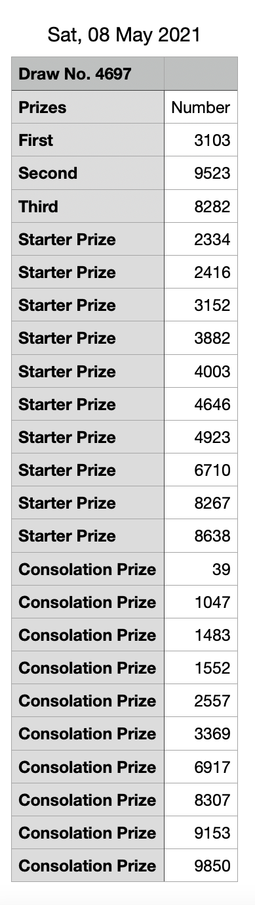

## Table Of Contents 
* [General Infomation](#general-info)
* [Technology](#technology)
* [Setup](#setup)
* [Status](#status)
* [Code Examples](#code-examples)

## General Infomation 
This project is used to collect data set from the 4D Website. Data collected are: 

* First prize
* Second prize
* Third prize
* Starter prize
* Consolation prize

## Technology/Features
Project is created with:
* BeautifulSoup(bs4)
* Python FileWriter
* Regex(Regular Expression)

## Setup
For now, just copy and paste the files into your project. 

## Status
Project is in _in progess_. Some data are still not able to be scraped from the source. 

## Code Examples
Once the project runs, the user is required to enter the 4D website. 

_Enter 4D Website:_ `https://www.singaporepools.com.sg/en/product/pages/4d_results.aspx?sppl=RHJhd051bWJlcj00Njk3 `

After the data is collected, they will be dumped in a _.csv_ format.

After the file is dumped, go to the project directory and you can see a _.csv_ file written in the following format -> ` Sat, 08 May 2021.csv  `

